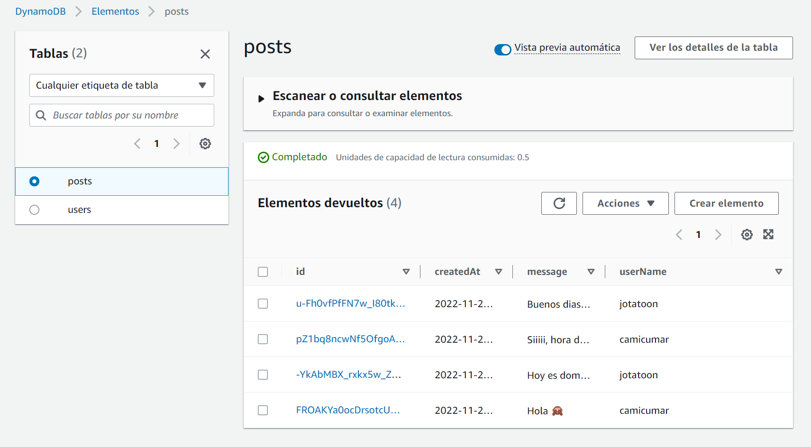

# Aygo - Taller 4

Este proyecto consta de una aplicación desarrollada en vue js, la cual permite registrar un usuario o iniciar sesión con un usuario existente. Al estar autenticado en la aplicación puede encontrar una página de inicio, la cual le permite al usuario publicar un post y visualizar los usuarios conectados actualmente. Adicionalmente, tiene una página que le permite editar información de su usuario. 

La aplicación esta preparada para ser desplegada a través de amplify en AWS, para el despliegue es necesario configurar las variables de entorno de los recursos a los que se encuentra ligada la aplicación.

```
VUE_APP_USER_POOL_ID=
VUE_APP_USER_POOL_WEB_CLIENT_ID=
VUE_APP_REGION=
VUE_APP_API_URL=https://{restapi_id}.execute-api.{region}.amazonaws.com/{stage}
```
Al finalizar el despliegue la aplicación podra verificar la configuración 


La autenticación de los usuarios se realiza a través del grupo de cognito mccm_users


Este grupo de usuarios se configuró como método de autorización en el API REST MCCM


Adicionalmente el API REST se encuentra asociado a la función mccmLambda


A su vez la lambda despliega dos servicios, cada uno con su propia tabla


Para acceder a la aplicación es necesario copiar la url de la ramificación que genero amplify en el navegador, la url redirige al login de la aplicación. Donde es necesario crear un nuevo usuario


Al ingresar los datos, al correo registrado se envia un codigo de verificación como el que se muestra a continuación


Ese código debe ingresarse en la página de verificación de la aplicación 


Una vez que se realice el registro correctamente, la aplicación se encarga de redirigir al usuario a su perfil para que pueda ser editado.


El registro se puede ver reflejado en la tabla de usuarios


Cuando el usuario se dirige a home puede visualizar los posts que se han creado hasta el momento y los usuarios que se encuentran conectados. En la primera imagen podemos evidenciar el estado de home cuando el primer usuario se registra.


Cuando otro usuario se conecta y publica un post, los demas usuarios pueden visualizar en su página de inicio el post y los usuarios que se encuentren conectados


Todos los post se registran en la tabla de dynamo


